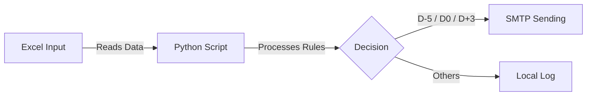

# AuroraPay Billing Email System 🚀

> [!NOTE]
> **Brazilian Project 🇧🇷**: This system was originally developed in Portuguese-BR to serve the local simplified billing management market.

<p align="center">
  <a href="README.md">🇧🇷 Português</a> | 
  <a href="README.en.md">🇺🇸 English</a> | 
  <a href="README.es.md">🇪🇸 Español</a>
</p>

---

## 🧭 Navigation Menu
- [🎯 Project Objective](#-project-objective)
- [👥 Target Audience](#-target-audience)
- [📈 Benefits and Gains](#-benefits-and-gains)
- [⚡ Main Features](#-main-features)
- [🖼️ Template Visualization](#-template-visualization)
- [🚀 How to Use](#-how-to-use)
- [📚 Full Documentation](#-full-documentation)

---

## 🎯 Project Objective
This project was developed for a **Technical Product Manager Portfolio**, demonstrating:
*   Clean Architecture.
*   Process Automation (RPA).
*   Standardized Technical Documentation.

## 👥 Target Audience
This solution was designed for:
*   **Small and Medium Enterprises (SMEs)**: Who still manage their billings via spreadsheets and seek to automate customer contact.
*   **Financial Departments**: That need to reduce the manual effort of sending reminders and billings.
*   **IT Professionals / Product Managers**: Who seek a modular base structure to scale financial RPA solutions.

## 📈 Benefits and Gains
Adopting this automation structure provides:
1.  **Reduction of Delinquency**: Preventive reminders (D-5) increase the on-time payment rate.
2.  **Operational Time Savings**: Eliminates the need for manual one-by-one email sending.
3.  **Brand Standardization**: HTML templates ensure professional and uniform communication.
4.  **Scalability**: Modular structure that allows easy addition of new channels (WhatsApp, SMS) or Payment Gateways.

---

## ⚡ Main Features

| Feature | Description |
| :--- | :--- |
| 📧 **Automatic Sending** | Triggers emails based on rules (5 days before, on the day, 3 days after). |
| 🎨 **HTML Templates** | Professional layouts with dynamic item tables. |
| 📊 **Excel V2** | Support for relational multiple tabs (Customers, Invoices, Items). |
| 🛡️ **Idempotency** | Ensures the same email is not sent twice on the same day. |
| 🧪 **Test Mode** | Simulates sending without affecting real history. |

---

## 🖼️ Template Visualization
See how emails are delivered to customers:

| 🗓️ Reminder (D-5) | ✅ Due Date (D0) | ⚠️ Overdue (D+3) |
| :---: | :---: | :---: |
|  |  |  |

---

## 🔄 Processing Flow


> *For the detailed technical flow, see the full documentation.*

---

## 🚀 How to Use

### 1. Installation
```bash
# Clone and enter the folder
git clone https://github.com/deividnf/AuroraPay_Servicos_Digitais.git
cd aurorapay

# Create virtual environment
python -m venv venv
.\venv\Scripts\activate

# Install dependencies
pip install -r requirements.txt
```

### 2. Configuration
Rename `.env.example` to `.env` and configure your SMTP:
```env
SMTP_EMAIL=your_email@gmail.com
SMTP_PASSWORD=google_app_password
```

### 3. Execution
| Scenario | Command |
| :--- | :--- |
| **Production (Daily)** | `python src/main.py` |
| **Simulation (Test)** | `python src/main.py --test` |
| **Test Overdue** | `python src/main.py --test --rule D+3` |

---

## 📚 Full Documentation
Access the `docs/en/` folder for technical details:
- 🏗️ **[System Architecture](docs/en/ARCHITECTURE.md)**: Technical overview and design decisions.
- 🔀 **[Detailed Flowchart](docs/en/FLOWCHART.md)**: Visual diagram of the decision process.
- 📋 **[Requirements](docs/en/REQUIREMENTS.md)**: List of functional and non-functional requirements.
- 📖 **[Standard Operating Procedure (SOP)](docs/en/POP.md)**: Step-by-step guide for execution and operation.

---

## ⚠️ Disclaimer & Professional Contact

> [!IMPORTANT]
> **Portfolio Note**: This is a simplified scope solution for technical demonstration. It does not replace a full ERP.

### 💡 Need a robust solution (Enterprise)?
If you are looking for a **scalable billing system, integrated with Payment Gateways (Pix API, Bill, Card)** and recursion management, get in touch. I develop custom architectures tailored to your business.

**Deivid Nascimento**  
*Technical Product Manager | Solutions Architect | Requirements Analyst*  
👉 [Access my LinkedIn](https://www.linkedin.com/in/dednascimento/) | ✉️ [Corporate E-mail](mailto:deividnascimento.corporativo@gmail.com)
