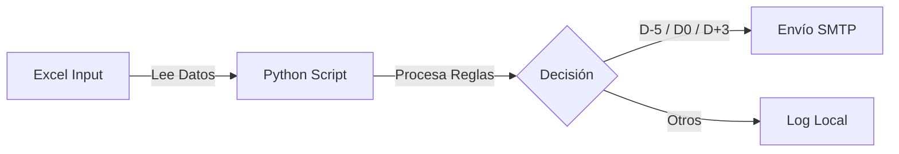

# Sistema de Correo Electrónico para Cobro - AuroraPay 🚀

> [!NOTE]
> **Proyecto Brasileño 🇧🇷**: Este es un sistema desarrollado originalmente em Portugués-BR para atender al mercado local de gestión de cobro simplificado.

<p align="center">
  <a href="README.md">🇧🇷 Português</a> | 
  <a href="README.en.md">🇺🇸 English</a> | 
  <a href="README.es.md">🇪🇸 Español</a>
</p>

---

  


## 🧭 Menú de Navegación
- [🎯 Objetivo del Proyecto](#-objetivo-del-proyecto)
- [👥 Público Objetivo](#-público-objetivo)
- [📈 Beneficios y Ganancias](#-beneficios-y-ganancias)
- [⚡ Funcionalidades](#-funcionalidades-principais)
- [🖼️ Visualización de Plantillas](#-visualización-de-plantillas)
- [🚀 Cómo Usar](#-cómo-usar)
- [📚 Documentación Completa](#-documentación-completa)

---

## 🎯 Objetivo del Proyecto
Este proyecto fue desarrollado para un **Portafolio de Technical Product Manager**, demostrando:
*   Arquitectura Limpia (Clean Architecture).
*   Automatización de Procesos (RPA).
*   Documentación Técnica Estandarizada.

## 👥 Público Objetivo
Esta solución fue diseñada para:
*   **Pequeñas y Medianas Empresas (PYMEs)**: Que aún gestionan sus cobros mediante hojas de cálculo y buscan automatizar el contacto con el cliente.
*   **Departamentos Financieros**: Que necesitan reducir el esfuerzo manual de envío de recordatorios y cobros.
*   **Profesionales de TI / Product Managers**: Que buscan una estructura base modular para escalar soluciones de RPA financiero.

## 📈 Beneficios y Ganancias
La adopción de esta estructura de automatización proporciona:
1.  **Reducción de Morosidad**: Los recordatorios preventivos (D-5) aumentan la tasa de pago a tiempo.
2.  **Ahorro de Tiempo Operativo**: Elimina la necesidad de envío manual de correos uno a uno.
3.  **Estandarización de Marca**: Las plantillas HTML garantizan una comunicación profesional y uniforme.
4.  **Escalabilidad**: Estructura modular que permite la fácil adición de nuevos canales (WhatsApp, SMS) o Pasarelas de Pago.

---

## ⚡ Funcionalidades Principales

| Funcionalidad | Descripción |
| :--- | :--- |
| 📧 **Envío Automático** | Activa correos basados en reglas (5 días antes, el día, 3 días después). |
| 🎨 **Plantillas HTML** | Diseños profesionales con tablas dinámicas de artículos. |
| 📊 **Excel V2** | Soporte para múltiples pestañas relacionales (Clientes, Facturas, Artículos). |
| 🛡️ **Idempotencia** | Asegura que el mismo correo no se envíe dos veces el mismo día. |
| 🧪 **Modo de Prueba** | Simula envíos sin afectar el historial real. |

---

## 🖼️ Visualización de Plantillas
Vea cómo se entregan los correos electrónicos a los clientes:

| 🗓️ Recordatorio (D-5) | ✅ Vencimiento (D0) | ⚠️ Atraso (D+3) |
| :---: | :---: | :---: |
|  |  |  |

---

## 🔄 Flujo de Procesamiento


> *Para el flujo técnico detallado, consulte la documentación completa.*

---

## 🚀 Cómo Usar

### 1. Instalación
```bash
# Clone y entre en la carpeta
git clone https://github.com/deividnf/AuroraPay_Servicos_Digitais.git
cd aurorapay

# Cree el ambiente virtual
python -m venv venv
.\venv\Scripts\activate

# Instale dependencias
pip install -r requirements.txt
```

### 2. Configuración
Cambie el nombre de `.env.example` a `.env` y configure su SMTP:
```env
SMTP_EMAIL=su_email@gmail.com
SMTP_PASSWORD=contraseña_app_google
```

### 3. Ejecución
| Escenário | Comando |
| :--- | :--- |
| **Producción (Diário)** | `python src/main.py` |
| **Simulación (Prueba)** | `python src/main.py --test` |
| **Probar Atrasados** | `python src/main.py --test --rule D+3` |

---

## 📚 Documentación Completa
Acceda a la carpeta `docs/es/` para detalles técnicos:
- 🏗️ **[Arquitectura del Sistema](docs/es/ARCHITECTURE.md)**: Visión técnica y decisiones de diseño.
- 🔀 **[Diagrama de Flujo Detallado](docs/es/FLOWCHART.md)**: Diagrama visual del proceso de decisión.
- 📋 **[Requisitos](docs/es/REQUIREMENTS.md)**: Lista de requisitos funcionales y no funcionales.
- 📖 **[Manual Operativo (POP)](docs/es/POP.md)**: Guía paso a paso para la ejecución y operación.

---

## ⚠️ Disclaimer & Contacto Profesional

> [!IMPORTANT]
> **Nota de Portafolio**: Esta es una solución de alcance simplificado para demostración técnica. No reemplaza a un ERP completo.

### 💡 ¿Necesita una solución robusta (Enterprise)?
Si busca un sistema de cobro **escalable, integrado con Pasarelas de Pago (Pix API, Boleto, Tarjeta)** y gestión de recurrencia, contácteme. Desenvuelvo arquitecturas personalizadas a la medida de su negocio.

**Deivid Nascimento**  
*Technical Product Manager | Arquitecto de Soluciones | Analista de Requisitos*  
👉 [Acceda a mi LinkedIn](https://www.linkedin.com/in/dednascimento/) | ✉️ [Correo Electrónico Corporativo](mailto:deividnascimento.corporativo@gmail.com)
