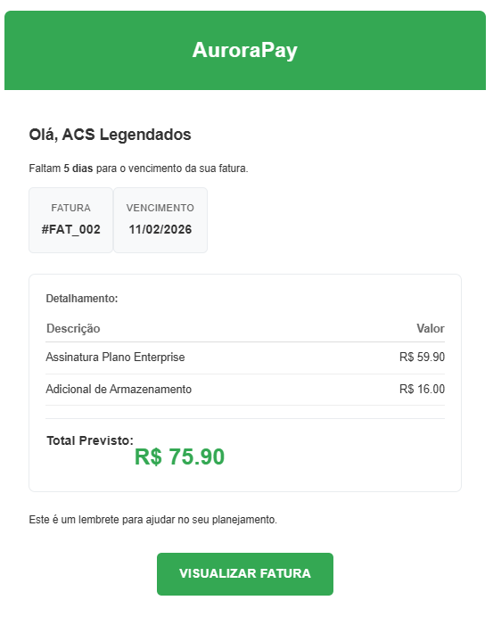
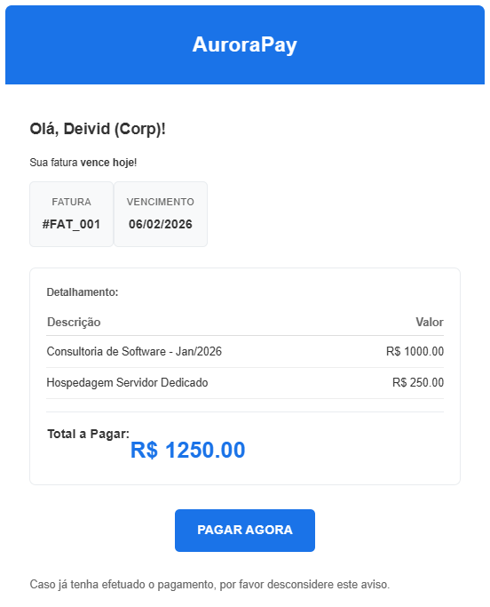
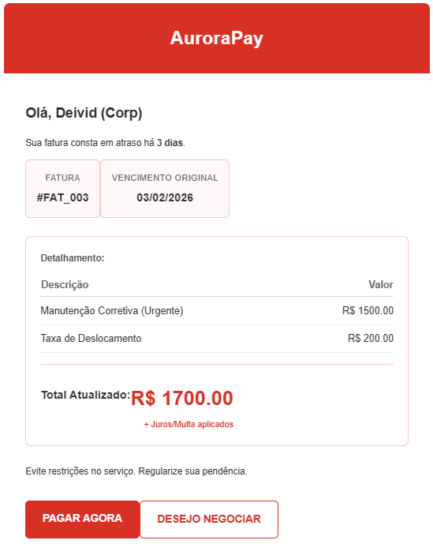
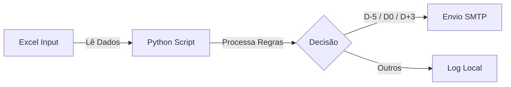

# Sistema de E-mail para Cobrança - AuroraPay 🚀

  

Sistema automatizado para envio de faturas e lembretes de cobrança via e-mail, focado em pequenas empresas que utilizam planilhas para gestão financeira.

## 🎯 Objetivo do Projeto
Este projeto foi desenvolvido para **Portfólio de um Technical Product Manager**, demonstrando:
*   Arquitetura Limpa (Clean Architecture).
*   Automação de Processos (RPA).
*   Documentação Técnica Padronizada.

---

## ⚡ Funcionalidades Principais

| Funcionalidade | Descrição |
| :--- | :--- |
| 📧 **Envio Automático** | Dispara e-mails baseados em regras (5 dias antes, no dia, 3 dias após). |
| 🎨 **Templates HTML** | Layouts profissionais com tabelas dinâmicas de itens. |
| 📊 **Excel V2** | Suporte a múltiplas abas relacional (Clientes, Faturas, Itens). |
| 🛡️ **Idempotência** | Garante que o mesmo e-mail não seja enviado duas vezes no mesmo dia. |
| 🧪 **Modo de Teste** | Simula envios sem afetar o histórico real. |

---

## 🖼️ Visualização dos Templates
Veja como os e-mails são entregues aos clientes:

| 🗓️ Lembrete (D-5) | ✅ Vencimento (D0) | ⚠️ Atraso (D+3) |
| :---: | :---: | :---: |
|  |  |  |

---

## 🔄 Fluxo de Processamento


> *Para o fluxo técnico detalhado, consulte a documentação completa.*

---

## 🚀 Como Usar

### 1. Instalação
```bash
# Clone e entre na pasta
git clone https://github.com/deividnf/AuroraPay_Servicos_Digitais.git
cd aurorapay

# Crie o ambiente virtual
python -m venv venv
.\venv\Scripts\activate

# Instale dependências
pip install -r requirements.txt
```

### 2. Configuração
Renomeie `.env.example` para `.env` e configure seu SMTP:
```env
SMTP_EMAIL=seu_email@gmail.com
SMTP_PASSWORD=senha_app_google
```

### 3. Execução
| Cenário | Comando |
| :--- | :--- |
| **Produção (Dia a Dia)** | `python src/main.py` |
| **Simulação (Teste)** | `python src/main.py --test` |
| **Testar Atrasados** | `python src/main.py --test --rule D+3` |

---

## 📚 Documentação Completa
Acesse a pasta `docs/` para detalhes técnicos:
- 🏗️ **[Arquitetura do Sistema](docs/ARCHITECTURE.md)**: Visão técnica e decisões de design.
- 🔀 **[Fluxograma Detalhado](docs/FLOWCHART.md)**: Diagrama visual do processo de decisão.
- 📋 **[Requisitos](docs/REQUIREMENTS.md)**: Lista de requisitos funcionais e não funcionais.
- 📖 **[Manual Operacional (POP)](docs/POP.md)**: Guia passo-a-passo para execução e operação.

---

## ⚠️ Disclaimer & Contato Profissional

> [!IMPORTANT]
> **Nota de Portfólio**: Esta é uma solução de escopo simplificado para demonstração técnica. Ela não substitui um ERP completo.

### 💡 Precisa de uma solução robusta (Enterprise)?
Se você busca um sistema de cobrança **escalável, integrado a Gateways de Pagamento (Pix API, Boleto, Cartão)** e com gestão de recorrência, entre em contato. Desenvolvo arquiteturas personalizadas sob medida para o seu negócio.

**Deivid Nascimento**  
*Technical Product Manager | Arquiteto de Soluções | Analista de Requisitos*  
👉 [Acesse meu LinkedIn](https://www.linkedin.com/in/dednascimento/) | ✉️ [E-mail Corporativo](mailto:deividnascimento.corporativo@gmail.com)
