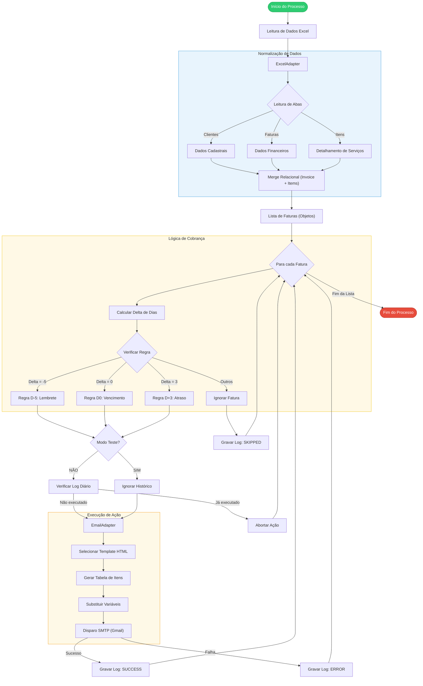

# Fluxograma do Processo

Este documento ilustra o fluxo de dados e decisão do Sistema de Cobrança AuroraPay.

```mermaid
flowchart TD
    %% Nós de Início e Dados
    Start([Início do Processo]) --> ReadExcel["Leitura de Dados Excel"]
    ReadExcel --> AdapterExcel[ExcelAdapter]
    
    subgraph DataNormalization [Normalização de Dados]
        AdapterExcel --> Sheets{Leitura de Abas}
        Sheets -->|Clientes| DataCli["Dados Cadastrais"]
        Sheets -->|Faturas| DataFat["Dados Financeiros"]
        Sheets -->|Itens| DataItens["Detalhamento de Serviços"]
        DataCli & DataFat & DataItens --> Merge["Merge Relacional (Invoice + Items)"]
    end
    
    Merge --> InvoiceList["Lista de Faturas (Objetos)"]
    InvoiceList --> LoopStart{Para cada Fatura}
    
    %% Loop de Processamento
    subgraph ProcessingStrategy [Lógica de Cobrança]
        LoopStart --> CalcDates["Calcular Delta de Dias"]
        CalcDates --> CheckRule{Verificar Regra}
        
        CheckRule -->|Delta = -5| RuleD_5["Regra D-5: Lembrete"]
        CheckRule -->|Delta = 0| RuleD0["Regra D0: Vencimento"]
        CheckRule -->|Delta = 3| RuleD3["Regra D+3: Atraso"]
        CheckRule -->|Outros| Skip[Ignorar Fatura]
    end
    
    %% Validação e Segurança
    RuleD_5 & RuleD0 & RuleD3 --> TestCheck{Modo Teste?}
    
    TestCheck -->|NÃO| Idempotency["Verificar Log Diário"]
    TestCheck -->|SIM| BypassLog["Ignorar Histórico"]
    
    Idempotency -->|Já executado| StopAction[Abortar Ação]
    Idempotency -->|Não executado| SendAction
    BypassLog --> SendAction
    
    %% Ação de Envio
    subgraph ActionExecution [Execução de Ação]
        SendAction[EmailAdapter] --> TplSelect["Selecionar Template HTML"]
        TplSelect --> GenTable["Gerar Tabela de Itens"]
        GenTable --> ReplaceVars["Substituir Variáveis"]
        ReplaceVars --> SMTP["Disparo SMTP (Gmail)"]
    end
    
    SMTP -->|Sucesso| LogSuccess["Gravar Log: SUCCESS"]
    SMTP -->|Falha| LogError["Gravar Log: ERROR"]
    Skip --> LogSkip["Gravar Log: SKIPPED"]
    StopAction --> LoopStart
    
    LogSuccess & LogError & LogSkip --> LoopStart
    LoopStart -->|Fim da Lista| End([Fim do Processo])

    %% Estilização
    style Start fill:#2ecc71,stroke:#27ae60,color:white
    style End fill:#e74c3c,stroke:#c0392b,color:white
    style DataNormalization fill:#e8f4fd,stroke:#3498db
    style ProcessingStrategy fill:#fff9e6,stroke:#f1c40f
    style ActionExecution fill:#fef9e7,stroke:#f39c12
```
