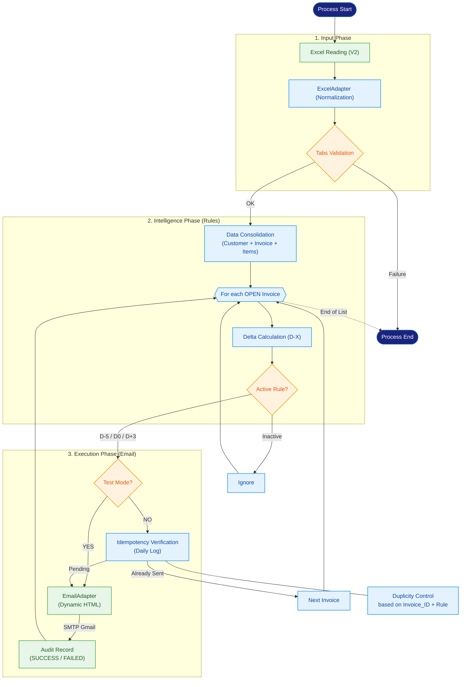

# Process Flowchart

> **Overview**: Detailed logical flow of the AuroraPay automation.

```mermaid
flowchart TD
    %% Class Definitions
    classDef startEnd fill:#1A237E,stroke:#0D47A1,color:#ffffff,stroke-width:2px;
    classDef process fill:#E3F2FD,stroke:#2196F3,color:#0D47A1,stroke-width:1.5px;
    classDef io fill:#E8F5E9,stroke:#4CAF50,color:#1B5E20,stroke-width:1.5px;
    classDef decision fill:#FFF3E0,stroke:#FF9800,color:#E65100,stroke-width:1.5px;
    classDef error fill:#FFEBEE,stroke:#F44336,color:#B71C1C,stroke-width:1.5px;

    %% Nodes
    Start([Process Start]):::startEnd
    End([Process End]):::startEnd

    subgraph InputPhase ["1. Input Phase"]
        direction TB
        ReadExcel["Excel Reading (V2)"]:::io
        AdapterExcel["ExcelAdapter (Normalization)"]:::process
        Sheets{Tabs Validation}:::decision
    end

    subgraph LogicPhase ["2. Intelligence Phase (Rules)"]
        direction TB
        Merge["Data Consolidation<br/>(Customer + Invoice + Items)"]:::process
        LoopStart{{For each OPEN Invoice}}:::process
        CalcDates["Delta Calculation (D-X)"]:::process
        CheckRule{Active Rule?}:::decision
    end

    subgraph ActionPhase ["3. Execution Phase (Email)"]
        direction TB
        TestCheck{Test Mode?}:::decision
        CheckLog["Idempotency Verification<br/>(Daily Log)"]:::process
        SendEmail["EmailAdapter<br/>(Dynamic HTML)"]:::io
        StatusLog["Audit Record<br/>(SUCCESS / FAILED)"]:::io
    end

    %% Connections
    Start --> ReadExcel
    ReadExcel --> AdapterExcel
    AdapterExcel --> Sheets
    
    Sheets -->|OK| Merge
    Sheets -->|Failure| End
    
    Merge --> LoopStart
    LoopStart --> CalcDates
    CalcDates --> CheckRule

    CheckRule -->|D-5 / D0 / D+3| TestCheck
    CheckRule -->|Inactive| Skip["Ignore"]:::process
    Skip --> LoopStart

    TestCheck -->|NO| CheckLog
    TestCheck -->|YES| SendEmail

    CheckLog -->|Already Sent| Next["Next Invoice"]:::process
    CheckLog -->|Pending| SendEmail

    SendEmail -->|SMTP Gmail| StatusLog
    StatusLog --> LoopStart
    Next --> LoopStart
    
    LoopStart -.->|End of List| End

    %% Notes
    Note1["Duplicity Control<br/>based on Invoice_ID + Rule"]:::process
    CheckLog --- Note1
```

---
*This flowchart represents the business logic implemented in version v2.1.*
