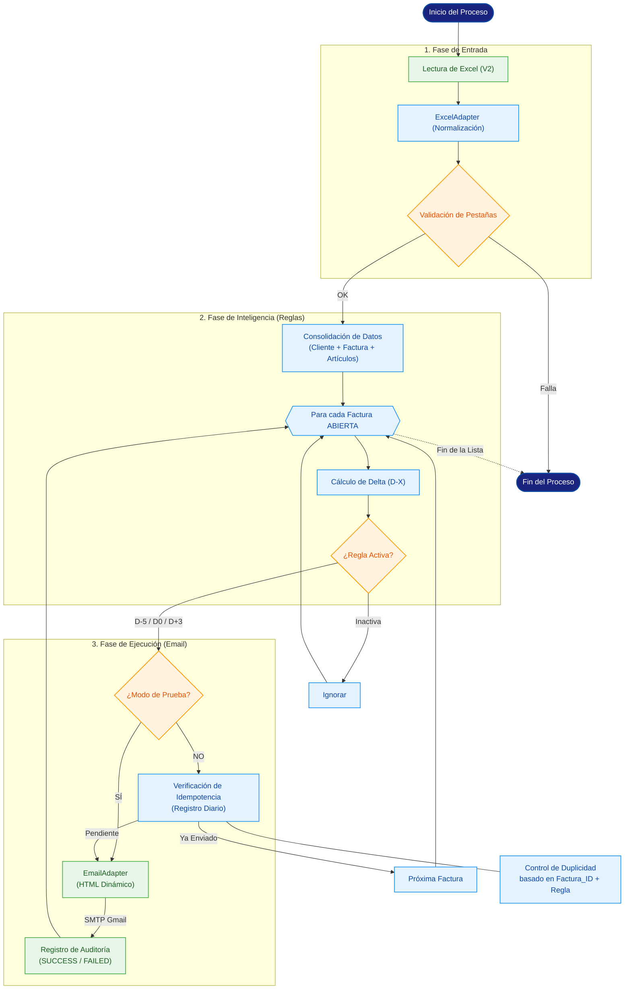

# Diagrama de Flujo del Proceso

> **Visión General**: Flujo lógico detallado de la automatización AuroraPay.

---
*Este diagrama de flujo representa la lógica de negocio implementada en la versión v2.1.*
