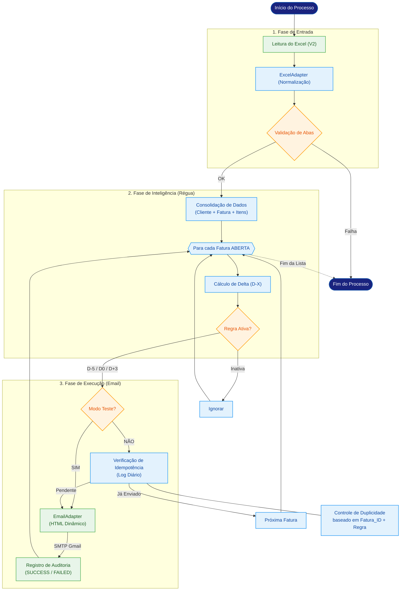

# Fluxograma do Processo

> **Visão Geral**: Fluxo lógico detalhado da automação AuroraPay.

```mermaid
flowchart TD
    %% Class Definitions
    classDef startEnd fill:#1A237E,stroke:#0D47A1,color:#ffffff,stroke-width:2px;
    classDef process fill:#E3F2FD,stroke:#2196F3,color:#0D47A1,stroke-width:1.5px;
    classDef io fill:#E8F5E9,stroke:#4CAF50,color:#1B5E20,stroke-width:1.5px;
    classDef decision fill:#FFF3E0,stroke:#FF9800,color:#E65100,stroke-width:1.5px;
    classDef error fill:#FFEBEE,stroke:#F44336,color:#B71C1C,stroke-width:1.5px;

    %% Nodes
    Start([Início do Processo]):::startEnd
    End([Fim do Processo]):::startEnd

    subgraph InputPhase ["1. Fase de Entrada"]
        direction TB
        ReadExcel["Leitura do Excel (V2)"]:::io
        AdapterExcel["ExcelAdapter (Normalização)"]:::process
        Sheets{Validação de Abas}:::decision
    end

    subgraph LogicPhase ["2. Fase de Inteligência (Régua)"]
        direction TB
        Merge["Consolidação de Dados<br/>(Cliente + Fatura + Itens)"]:::process
        LoopStart{{Para cada Fatura ABERTA}}:::process
        CalcDates["Cálculo de Delta (D-X)"]:::process
        CheckRule{Regra Ativa?}:::decision
    end

    subgraph ActionPhase ["3. Fase de Execução (Email)"]
        direction TB
        TestCheck{Modo Teste?}:::decision
        CheckLog["Verificação de Idempotência<br/>(Log Diário)"]:::process
        SendEmail["EmailAdapter<br/>(HTML Dinâmico)"]:::io
        StatusLog["Registro de Auditoria<br/>(SUCCESS / FAILED)"]:::io
    end

    %% Connections
    Start --> ReadExcel
    ReadExcel --> AdapterExcel
    AdapterExcel --> Sheets
    
    Sheets -->|OK| Merge
    Sheets -->|Falha| End
    
    Merge --> LoopStart
    LoopStart --> CalcDates
    CalcDates --> CheckRule

    CheckRule -->|D-5 / D0 / D+3| TestCheck
    CheckRule -->|Inativa| Skip["Ignorar"]:::process
    Skip --> LoopStart

    TestCheck -->|NÃO| CheckLog
    TestCheck -->|SIM| SendEmail

    CheckLog -->|Já Enviado| Next["Próxima Fatura"]:::process
    CheckLog -->|Pendente| SendEmail

    SendEmail -->|SMTP Gmail| StatusLog
    StatusLog --> LoopStart
    Next --> LoopStart
    
    LoopStart -.->|Fim da Lista| End

    %% Notes
    Note1["Controle de Duplicidade<br/>baseado em Fatura_ID + Regra"]:::process
    CheckLog --- Note1
```

---
*Este fluxograma representa a lógica de negócio implementada na versão v2.1.*
